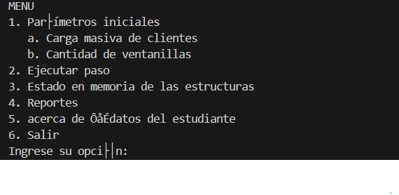
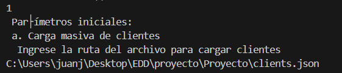
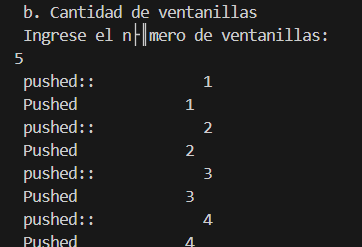
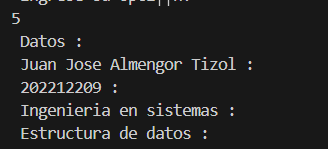
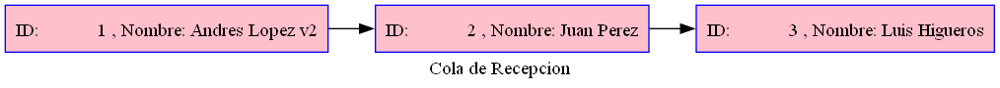

# MANUAL DE USUARIO 

## Requisitos del sistema

Para que nuestro programa funcione correctamente tenemos que tener instalados algunos programas:

1. Instalar Visual Studio Code en nuestra computadora.
2. Instalar Fortran, preferiblemente la version mas reciente o que sea estable.
3. Tener instalado Graphviz.
4. Instalar un lector de pdf.
  

## Menu Inicial
Iniciamos nuestro programa y nos dira esto, es un menu de inicio. 

### Paso 2
Aqui cargamos el archivo json con los clientes:

Y ahi podemos ver un ejemplo de como se guardaron.

Despues nos pedira ingresar a las ventanillas que queramos tener disponibles en nuestro programa.

Aqui podemos ver los datos tambien: 

###  Ventanillas

Este es un ejemplo de como se ven las ventanillas ya cargadas, claro estan vacias, pero depsues se llenan

###  Clientes

Aqui hay un ejemplo de los clientes ya guardados en al cola de recepcion.
